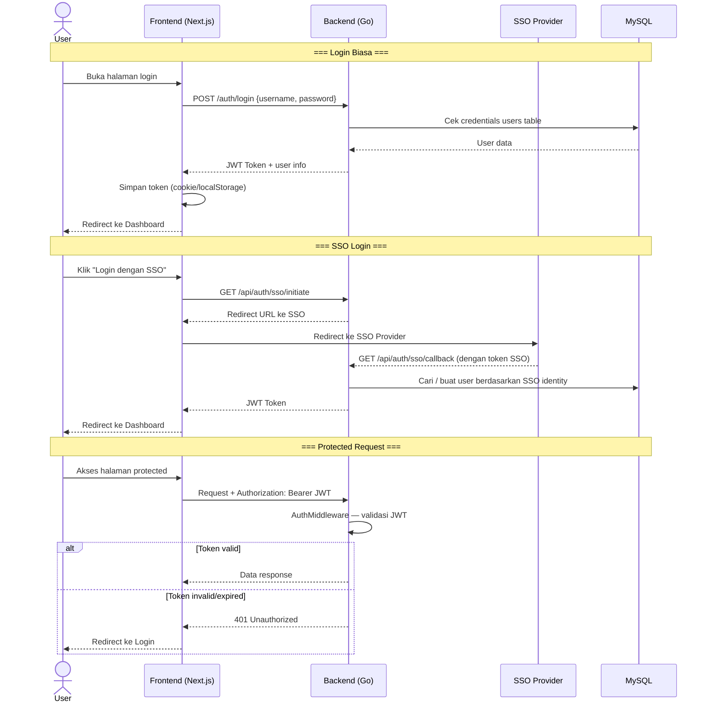
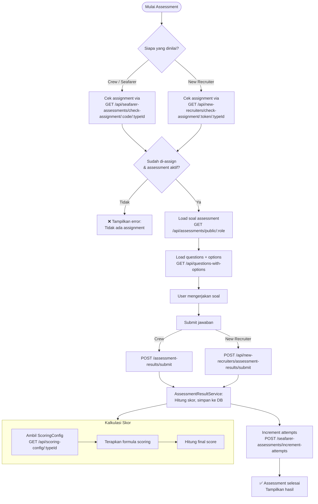
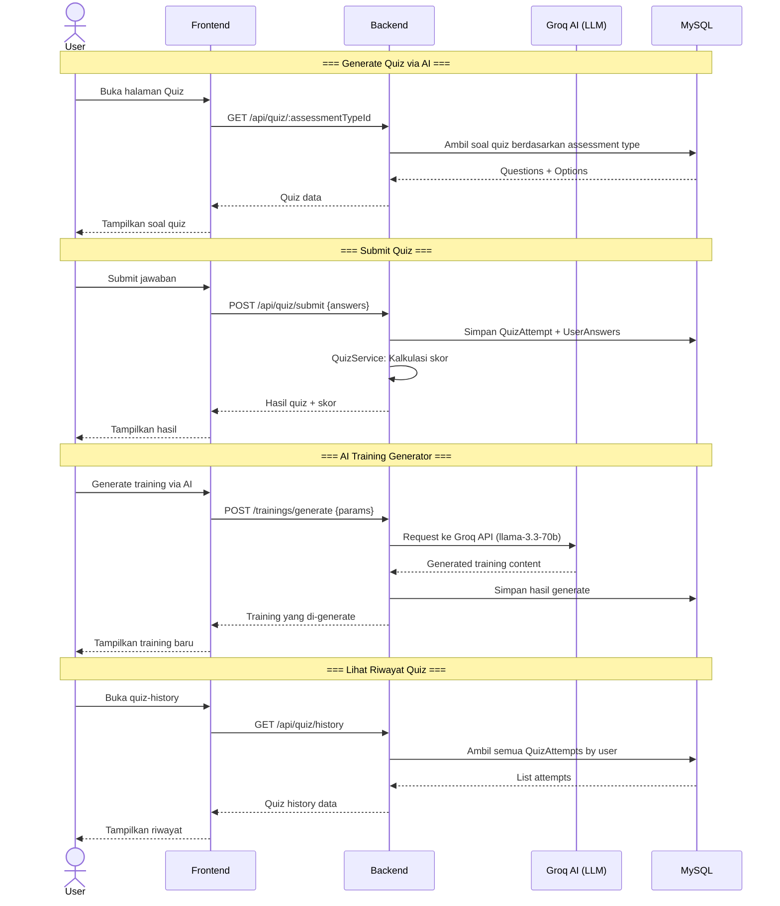
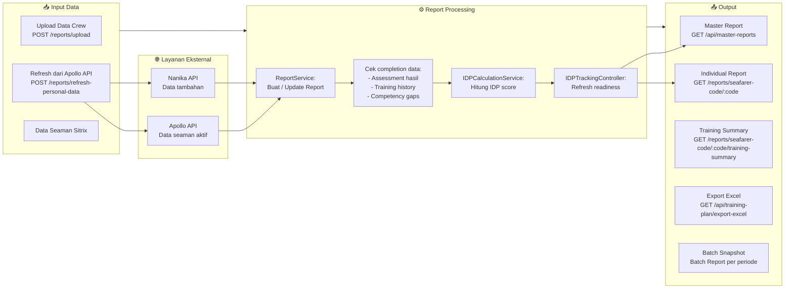
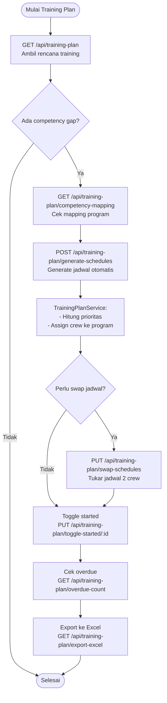
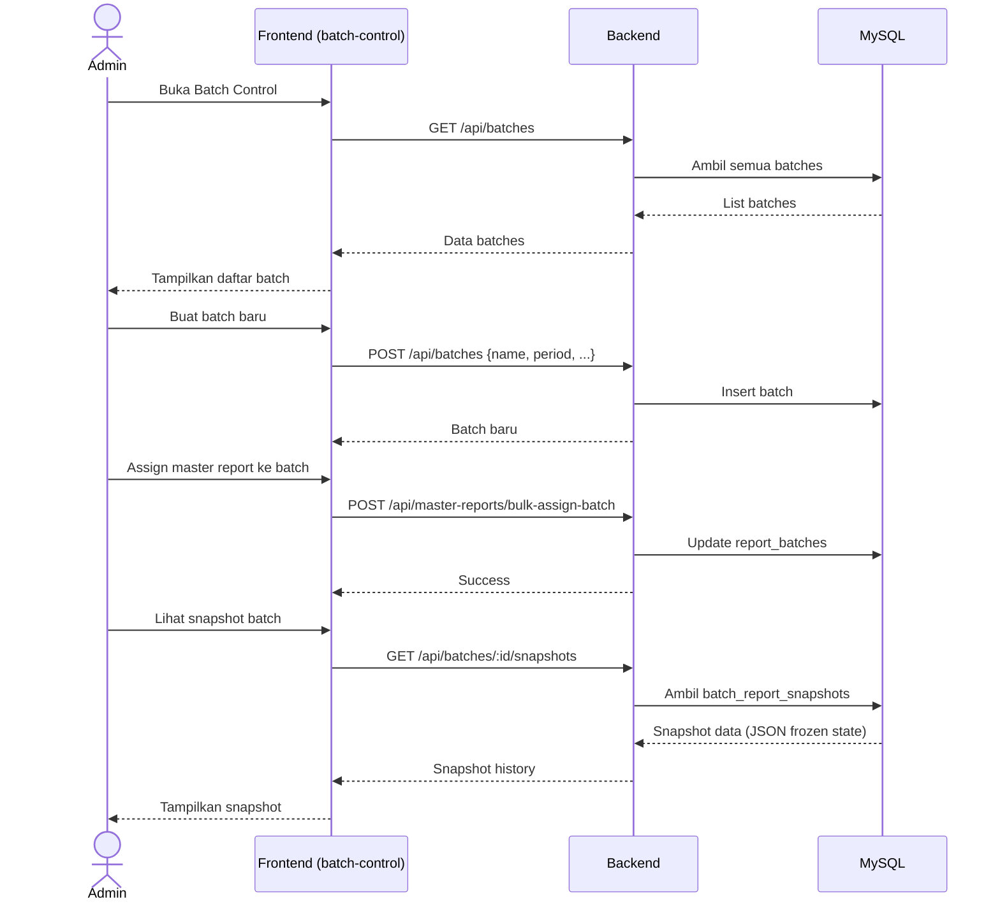
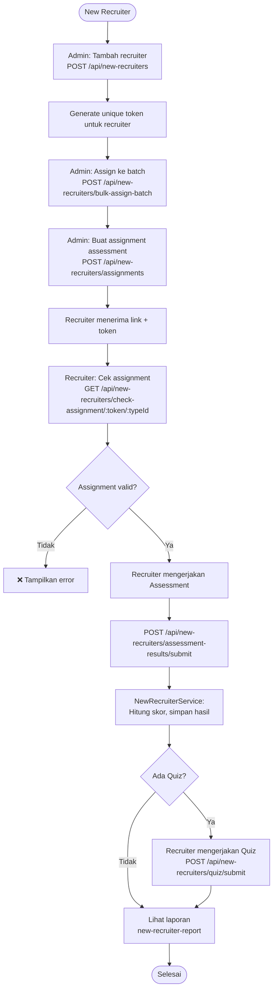
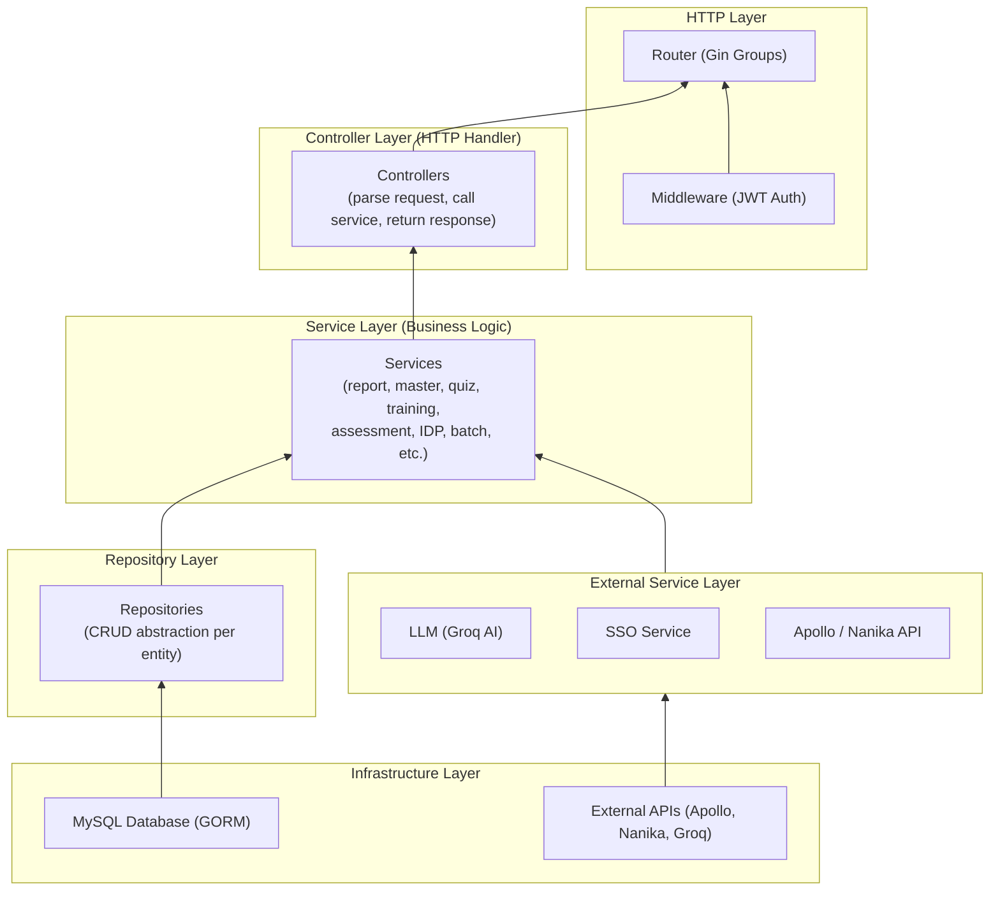

# 🏗️ TDS (Talent Development System) — Flow Diagram

Sistem manajemen talent development untuk evaluasi dan penilaian crew kapal.

> [!NOTE]
> Tech Stack: **Go (Gin)** backend · **Next.js 16 / React 19** frontend · **MySQL 8.0** · Docker

---

## 1. Arsitektur Sistem (System Architecture)

```mermaid
graph TB
    subgraph CLIENT["🖥️ Client Layer"]
        BROWSER["Browser / User"]
    end

    subgraph FRONTEND["⚛️ Frontend — Next.js 16 :3000/:3001"]
        FE_AUTH["(auth) — Login / SSO"]
        FE_DASH["dashboard"]
        FE_ADMIN["admin-panel"]
        FE_ASSESS["assessment-manager"]
        FE_ASSESS_TYPE["assessment-type-manager"]
        FE_ASSESS_RESULT["assessment-results"]
        FE_CREW["crew-evaluation-system"]
        FE_QUIZ["quiz / quiz-history"]
        FE_ASSIGN["assignments"]
        FE_BATCH["batch-control"]
        FE_MASTER["master-report"]
        FE_NEW_REC["new-recruiter / report"]
        FE_MENTOR["report-mentoring"]
        FE_VALUE["value-assessment"]
    end

    subgraph BACKEND["🐹 Backend — Go Gin :8080/:8081"]
        BE_ROUTER["Router / Middleware"]
        subgraph CONTROLLERS["Controllers"]
            C_USER["UserController"]
            C_ASSESS["AssessmentController"]
            C_ASSESS_TYPE["AssessmentTypeController"]
            C_ASSESS_RESULT["AssessmentResultController"]
            C_QUIZ["QuizController"]
            C_SEAFARER["SeafarerAssessmentController"]
            C_REPORT["ReportController"]
            C_MASTER["MasterController"]
            C_TRAINING["TrainingController + LLM Gen"]
            C_TRAINING_PLAN["TrainingPlanController"]
            C_MENTORING["MentoringReportController"]
            C_COACHING["CoachingReportController"]
            C_ASSIGN["AssignmentController"]
            C_BATCH["BatchController"]
            C_NEW_REC["NewRecruiterController"]
            C_SCORING["ScoringConfigController"]
            C_COMP["CompetencyMappingController"]
            C_IDP["IDPTrackingController"]
        end
        subgraph SERVICES["Services / Business Logic"]
            S_USER["UserService"]
            S_ASSESS["AssessmentService + ResultService"]
            S_QUIZ["QuizService"]
            S_SEAFARER["SeafarerAssessmentService"]
            S_REPORT["ReportService"]
            S_MASTER["MasterService"]
            S_TRAINING["TrainingService + TrainingPlanService"]
            S_MENTORING["MentoringReportService"]
            S_COACHING["CoachingReportService"]
            S_ASSIGN["AssignmentService"]
            S_BATCH["BatchService + SnapshotService"]
            S_NEW_REC["NewRecruiterService"]
            S_IDP["IDPCalculationService"]
            S_SCORING["ScoringConfigService (via AssessmentType)"]
            S_COMP["CompetencyMappingService"]
            S_SSO["SSOService"]
            S_GROQ["GroqLLM / Training AI Generator"]
            S_APOLLO["ApolloAPIService (External)"]
            S_NANIKA["NanikaAPIService (External)"]
            S_CRON["CronService (Auto-refresh)"]
        end
    end

    subgraph DB["🗄️ Database — MySQL 8.0 :3306"]
        T_USER["users"]
        T_REPORT["reports"]
        T_ASSESS["assessments"]
        T_ASSESS_TYPE["assessment_types"]
        T_ASSESS_RESULT["assessment_results"]
        T_QUIZ["quiz_attempts / user_answers"]
        T_SEAFARER["seafarer_assessments"]
        T_TRAINING["trainings / training_schedules"]
        T_MENTOR["mentoring_reports"]
        T_COACH["coaching_reports"]
        T_ASSIGN["assignments"]
        T_BATCH["batches / batch_report_snapshots"]
        T_NEW_REC["new_recruiters / assignments"]
        T_IDP["idp_tracking"]
        T_COMP["competency_program_mappings / competency_types"]
        T_SCORING["scoring_configs (via assessment_types)"]
    end

    subgraph EXTERNAL["🌐 External APIs"]
        EXT_SSO["SSO Provider (SAML/OAuth)"]
        EXT_GROQ["Groq AI API (llama-3.3-70b)"]
        EXT_APOLLO["Apollo API (Seaman Data)"]
        EXT_NANIKA["Nanika API"]
    end

    BROWSER -->|"HTTP Request"| FRONTEND
    FRONTEND -->|"REST API calls\n(NEXT_PUBLIC_API_ENDPOINT)"| BE_ROUTER
    BE_ROUTER --> CONTROLLERS
    CONTROLLERS --> SERVICES
    SERVICES --> DB
    SERVICES -->|"External calls"| EXTERNAL
```

---

## 2. Alur Autentikasi (Authentication Flow)

---

## 3. Alur Assessment (Penilaian Crew)

---

## 4. Alur Quiz

---

## 5. Alur Report & IDP (Individual Development Plan)

---

## 6. Alur Training Plan

---

## 7. Alur Batch & Snapshot

---

## 8. Alur New Recruiter

---

## 9. Layer Architecture Backend (Clean Architecture)

---

## 10. Ringkasan Endpoint API

| Grup | Endpoint Utama | Auth |
|------|---------------|------|
| **Auth** | `POST /auth/login`, `GET /api/auth/sso/initiate` | ❌ Public |
| **Users** | `GET/POST/PUT/DELETE /api/users` | ✅ JWT |
| **Reports** | `GET /reports`, `POST /reports/upload` | ❌ Public |
| **Assessments** | `GET /api/assessments`, `POST /api/assessments` | Mixed |
| **Assessment Types** | `GET/POST/PUT/DELETE /api/assessment-types` | Mixed |
| **Assessment Results** | `POST /assessment-results/submit` | ❌ Public |
| **Seafarer Assessments** | `GET/POST /api/seafarer-assessments` | Mixed |
| **Quiz** | `GET /api/quiz/:id`, `POST /api/quiz/submit` | ❌ Public |
| **Training** | `GET/POST/PUT/DELETE /trainings` | ❌ Public |
| **Training Plan** | `GET/POST /api/training-plan` | ❌ Public |
| **Mentoring Reports** | `GET/POST/PUT/DELETE /mentoring-reports` | ❌ Public |
| **Coaching Reports** | `GET/POST/PUT/DELETE /coaching-reports` | ❌ Public |
| **Master Reports** | `GET/POST/PUT/DELETE /api/master-reports` | ❌ Public |
| **Assignments** | `GET/POST /api/assignments` | ❌ Public |
| **Batches** | `GET/POST/PUT /api/batches` | ❌ Public |
| **New Recruiters** | `GET/POST /api/new-recruiters` | Mixed |
| **Competency Mapping** | `GET/POST/PUT/DELETE /api/competency-mappings` | ❌ Public |
| **IDP Tracking** | `POST /api/idp-tracking/refresh` | ❌ Public |
| **Scoring Config** | `GET/PUT /api/scoring-config/:typeId` | ❌ Public |
